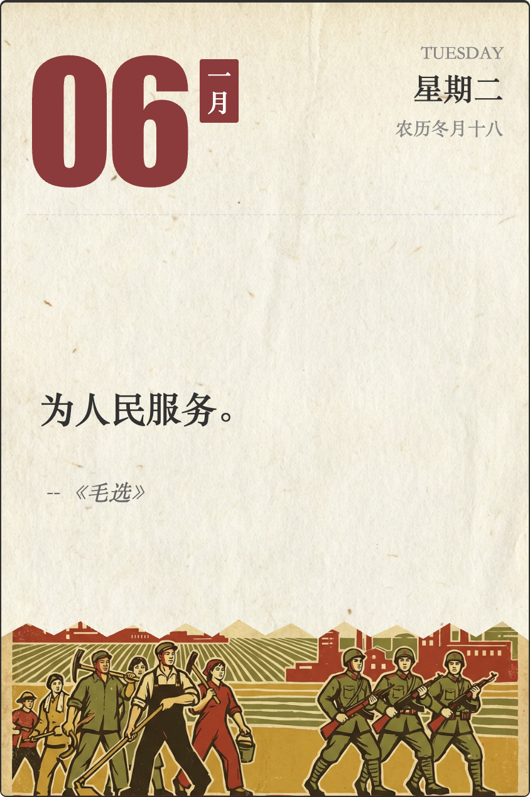

# Mao Style Calendar (毛式风格日历)

[](https://github.com/allennaur/mao-style-calendar/actions/workflows/deploy.yml)

一个极具时代特色的 Vue 3 电子日历项目，完美复刻了“老黄历”的视觉风格。



## ✨ 项目特色

- **经典复古设计**：采用大字号排版、纸质纹理背景以及具有年代感的配色。
- **每日金句**：每日随机展示《毛选》或伟人语录，激励向上。
- **功能完备**：
  - 支持公历/农历双重显示。
  - 中英文星期对照。
  - 自动根据当前日期更新。
- **拟真质感**：底部配图采用锯齿边缘处理，模拟撕纸效果；背景叠加陈旧纸张纹理。
- **响应式布局**：固定比例卡片更加美观。

## 🛠️ 技术栈

- **前端框架**: [Vue 3](https://vuejs.org/)
- **构建工具**: [Vite](https://vitejs.dev/)
- **日期处理**: [lunar-javascript](https://github.com/6tail/lunar-javascript) (农历支持)
- **样式**: CSS3 (Flexbox, Clip-path)

## 🚀 快速开始

### 1. 克隆项目

```bash
git clone https://github.com/allennaur/mao-style-calendar.git
cd mao-style-calendar
```

### 2. 安装依赖

```bash
npm install
```

### 3. 本地运行

```bash
npm run dev
```

打开浏览器访问 `http://localhost:5173` 即可看到效果。

### 4. 构建打包

```bash
npm run build
```

构建产物位于 `dist` 目录下。

## 📂 项目结构

```
├── public/
├── src/
│   ├── assets/          # 静态资源 (图片, JSON数据)
│   ├── components/      # Vue 组件
│   ├── App.vue          # 根组件
│   └── main.js          # 入口文件
├── vite.config.js       # Vite 配置
└── package.json
```

## ⚙️ 个性化配置

- **修改语录**: 编辑 `src/assets/quotes.json` 文件添加你喜欢的语录。
- **更换配图**: 替换 `src/assets` 目录下的图片资源。

## 📄 许可证

MIT License
